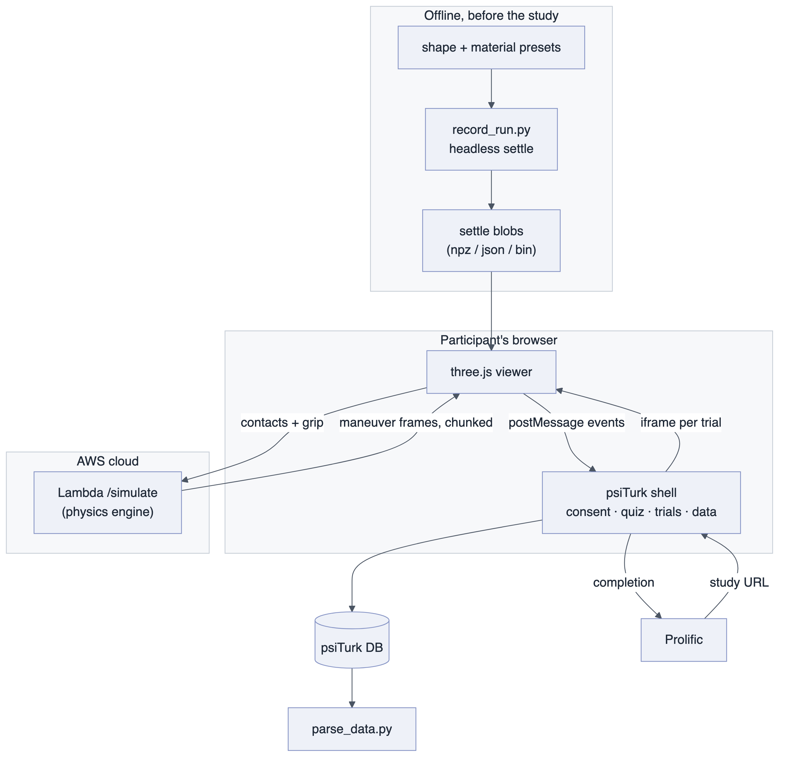

# Live compute in the trial loop

*Shawn Nordstrom (grasp project), September 2026.*

This template assumes stimuli are files––videos and images under `static/`,
played per trial. This document describes a variant where the stimulus
is computed during the trial from the participant's own action: the
participant clicks finger positions on a soft object, and a physics simulation
of the resulting pick-and-place streams back and plays, live, inside the trial
page. If your experiment needs anything computed per trial (a simulation, a
model inference, a generated image), this pattern may help!

The static case is also a subset of this one, so the architecture is also a
useful map of where each concern lives even for non-live-compute experiments.



| layer | what it is | where it runs |
| --- | --- | --- |
| 1. Stimulus generation | headless physics sim prerecords each object's settle phase | offline, once |
| 2. Viewer | three.js scene that plays blobs, takes clicks, plays the result | participant's browser (iframe) |
| 3. Live compute | the same physics engine behind an HTTP endpoint | AWS Lambda |
| 4. Experiment shell | psiTurk: consent, instructions, quiz, trial order, data capture | a lab server |
| 5. Recruitment | Prolific study pointing at the shell's entry page | Prolific |

One trial:

```
watch the object settle  →  click to place fingers  →  press GO  →  watch the pick-up
(prerendered, identical     (recorded)                              and placement
 for everyone)                                                      (simulated live)
```

## 1. Stimulus generation—stimuli as build products

Every stimulus starts as a *preset* (shape + material parameters) in
version-controlled config files; a headless script renders the settle phase
once into compact binary blobs. For this setup:

* **Identical for everyone**—the settle animation is prerendered, so no
  per-client physics variation or frame drops change what was seen.
* **Regenerable, not stored**—any stimulus can be rebuilt from its preset
  with one command, so the stimulus set is documented by construction.

The recorded stimuli and the live simulator come from the same physics model in this setup.

## 2. The viewer—one iframe per trial, events over postMessage

In this template a trial's frontend lives in `trial_page.js`. In the live-compute
variant, the trial page instead hosts **one fresh iframe per trial** running a
self-contained three.js viewer. Fresh-per-trial is chosen as the viewer holds
a lot of module-scope state (scene, playback cursor, picked probes), and
reloading it is a cheaper check of a clean slate than resetting that
state in place.

The iframe reports to the experiment shell over `postMessage`:

| message | when |
| --- | --- |
| `place_ready` | settle finished; the participant may click the object |
| `probes` | a finger was placed (running count + positions) |
| `go` | participant committed; the sim request goes out |
| `trial_complete` | maneuver finished playing—carries everything recorded |
| `error` | the trial could not load |

This boundary keeps the shell simple: it sequences iframes and records what
they report (the equivalent of `register_response` in this template), and it
never touches graphics or physics.

## 3. Live compute—a stateless simulation service

On GO, the finger positions and grip setting go to an AWS Lambda (or other host server) function running the same physics engine that generated the stimuli.

The service is **stateless**: each request carries the complete simulation
state, and the Lambda advances the physics one chunk (60 frames by default),
returning the new frames together with the updated state—so no session lives
on the server and any instance can compute the next chunk. Because simulating
is far faster than watching (a full ~270-frame maneuver costs ~0.5 s of compute
but tens of seconds of playback), the first chunk arrives almost immediately
and later chunks stream in well ahead of the playhead—the animation starts
right away and never stalls. Each request runs on its own Lambda instance, so
concurrent participants don't slow each other down.

## 4. Develop locally with a psiTurk stub

For easy local viewing: serve the experiment page with **one line changed**, loading a small stub in place of psiTurk's own JavaScript. The stub satisfies the same interface (`preloadPages`, `recordTrialData`, `saveData`, page sequencing) in ~150 lines, and a debug button shows every recorded row live as you click through trials.

## 5. What a trial row looks like

```json
{"phase": "TEST", "IsInstruction": false, "TrialName": "blob_demo",
 "trial_index": 0, "run": "blob_demo",
 "probes_ijk": [[5,5,12],[0,5,11]], "probes_vertex": [383,76], "n_probes": 2,
 "grip": 1, "placement_ms": 71, "watch_ms": 16446,
 "sim": {"n_frames": 271, "done": true, "sim_ms": 482.7, "finite": true}}
```